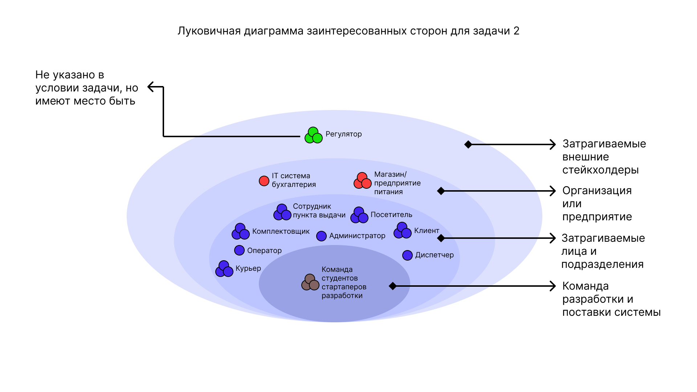
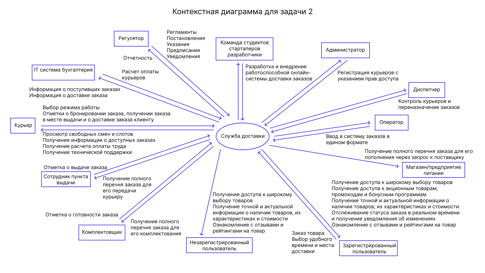
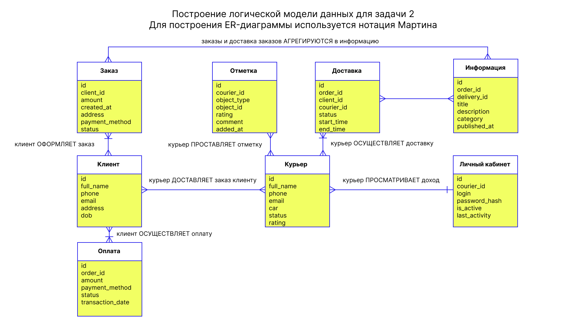
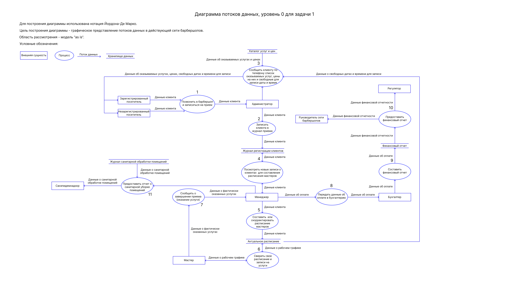
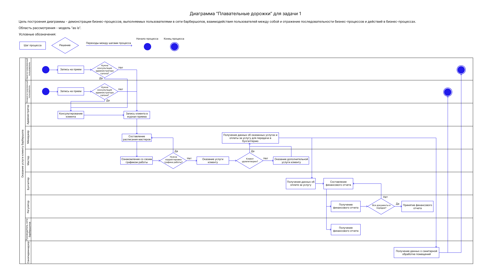
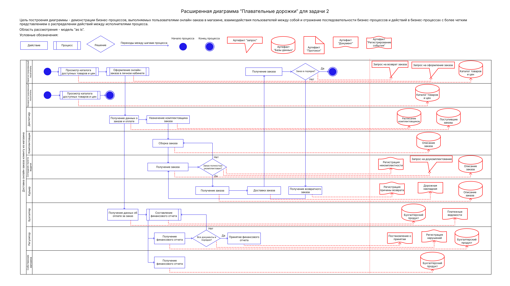
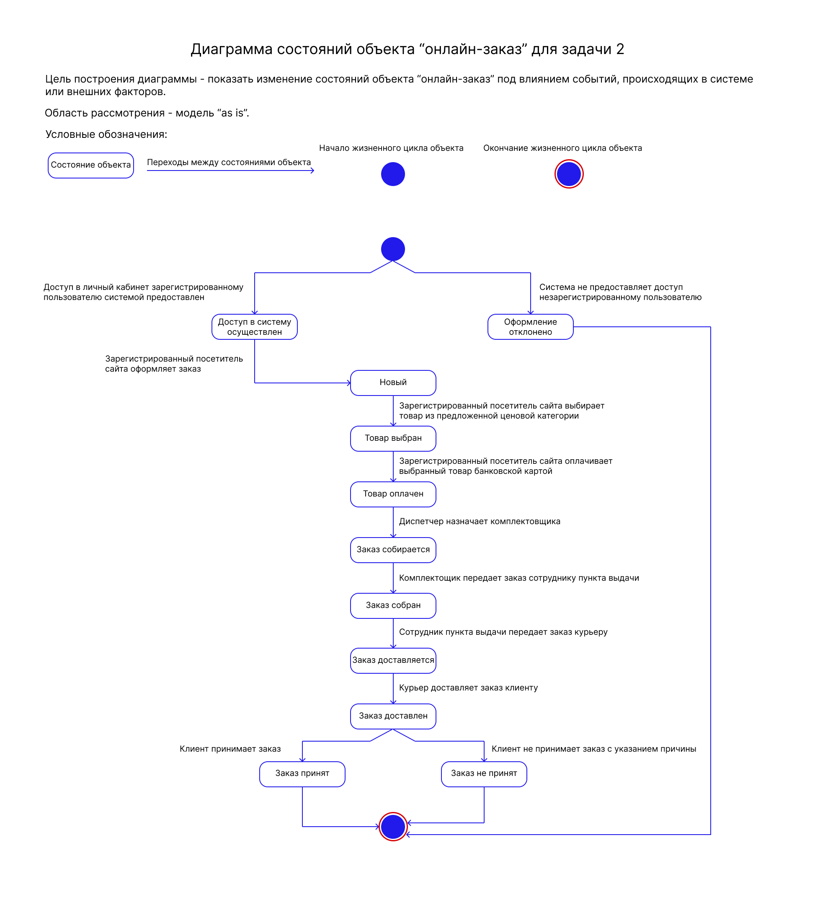
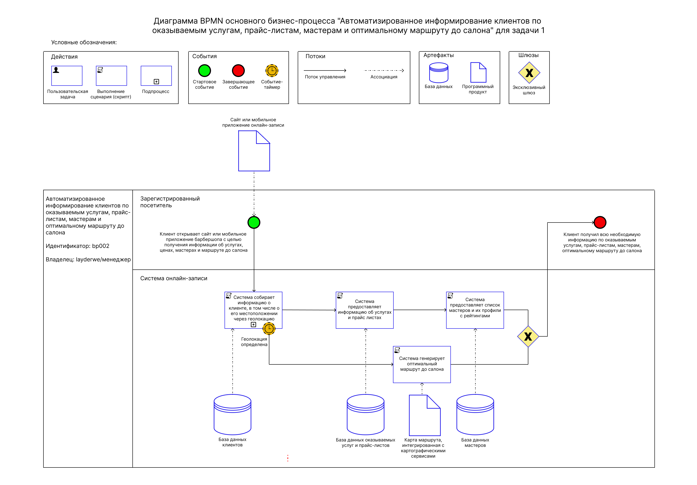

# Business Systems Analysis (анализ бизнес-систем)

Описание: 
Осуществлен анализ бизнес-систем для следующих задач: 

- Создание и внедрение системы, обеспечивающей онлайн-запись на прием в сети салонов барбершопа. Основная цель - развитие бизнеса путем расширения клиентской базы за счет возможности онлайн-записи, а также снижение трудозатрат сотрудников и уменьшение ручного труда за счет автоматического информирования клиентов по каналам связи. Префикс данного продукта BSH; 
- Создание и развертывание онлайн-системы курьерской службы доставки товаров индивидуальным клиентам от магазинов и предприятий питания. Префикс данного продукта DEO. 

В рамках решения поставленных задач выполнены следующие проекты: 

- BSA00_Decomposition: Определение источников данных, создание глоссария и задач декомпозиции. Проект позволяет ознакомиться с жизненным циклом разработки программного обеспечения, типичном составе команды и основных функциях каждого человека на этапах жизненного цикла; 
- BSA01_Stakeholders: Методы выявления заинтересованных сторон и методы работы с ними. Проект даёт понимание того, кто такие заинтересованные стороны и каково их значение для ИТ-систем; 
- BSA02_Requirements: Требования к программному обеспечению, их типы, уровни, отношения и зависимости. Модели «как есть AS IS» и «как должно быть TO BE», создание контекстной диаграммы, определение роли заинтересованных сторон, их проблемы и потребности, а также бизнес-требования продукта; 
- BSA03_HowToRequirements: Способы выявления требований, выявление бизнес-требований, построение функциональной ролевой модели и документирование требований; 
- BSA04_Domains: Концепция «домен», идентификация сущности домена. Системная информационная модель, построение и тестирование модели с помощью операций CRUD (create, read, update, delete); 
- BSA05_Diagrams: Концепция моделирования требований, базовых моделей и представлений. Построение диаграммы потоков данных, диаграммы дорожек и диаграммы состояний, таблицы решений; 
- BSA06_BPMN: Постоение и применение диаграммы BPMN (Business Process Model and Notation). Сравнение ее с ранее разработанными диаграммами; 
- BSA07_UserStory: Создание пользовательских историй (User Story), разработка критериев приемки и сценариев тестирования; 
- BSA08_UseCase: Создание вариантов использования - описание требований к системам, содержащих модели поведения программной системы или способы взаимодействия пользователей с системой; 
- BSA09_Objects_and_roles: Создание логической модели базы данных и словаря данных: сущностей (объектов), их атрибутов и диаграмм классов; 
- BSA10_FunctionalRequirements: Продолжение проектирования функциональности системы; 
- BSA11_UserInterfaces: Дизайн пользовательского интерфейса с точки зрения аналитика; 
- BSA12_NonfunctionalRequirements: Определение и формулирование нефункциональных требований; 
- BSA13_RequirementsManagements: Определение требований, установление связей между ними и отслеживание статуса требований; 
- BSA14_SystemIntegration: Интеграция ИТ-систем с использованием основных стилей; 
- BSA15_REST: Осуществление взаимодействия веб-сервисов между ИТ-системами посредством архитектурного стиля REST. Отображение данных (полученных и отправленных) и описание ошибок; 
- BSA16_SOAP: Осуществление взаимодействия веб-сервисов между ИТ-системами с использованием протокола SOAP. Чтение языка разметки XML-документов, который используется для передачи сообщений. 

**Луковичная диаграмма заинтересованных сторон для задачи 2:** 
 
**Контекстная диаграмма для задачи 2:** 
 
**Логическая модель данных для задачи 2:** 
 
**Диаграмма потоков данных уровень 0 для задачи 1:** 
 
**Диаграмма "плавательные дорожки" для задачи 1:** 
 
**Расширенная диаграмма "плавательные дорожки" для задачи 2:** 
 
**Диаграмма состояний объекта "онлайн-заказ" для задачи 2:** 
 
**Диаграмма BPMN основного бизнес-процесса "Автоматизированное информирование клиентов" для задачи 1:** 
 
**Создание и регистрация требований в Trello для задачи 1:** 
 
